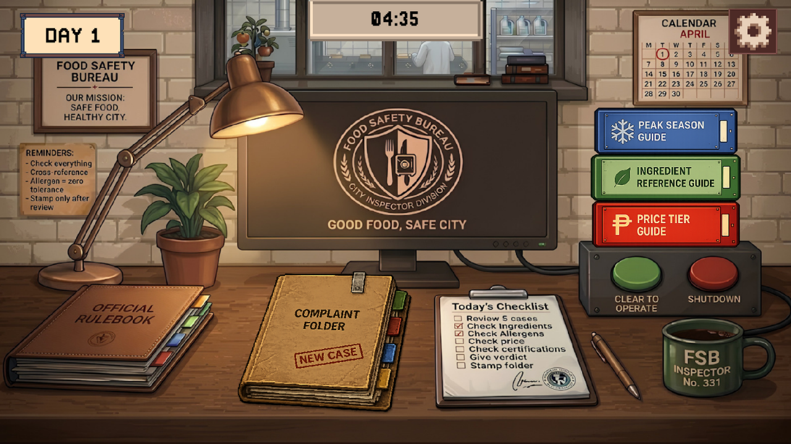
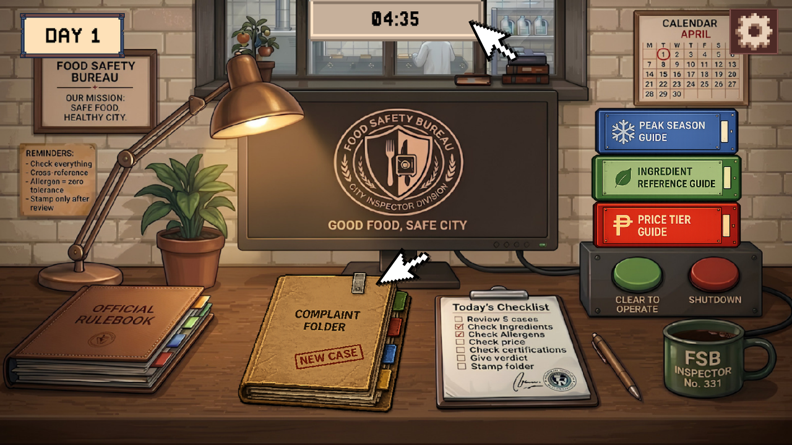
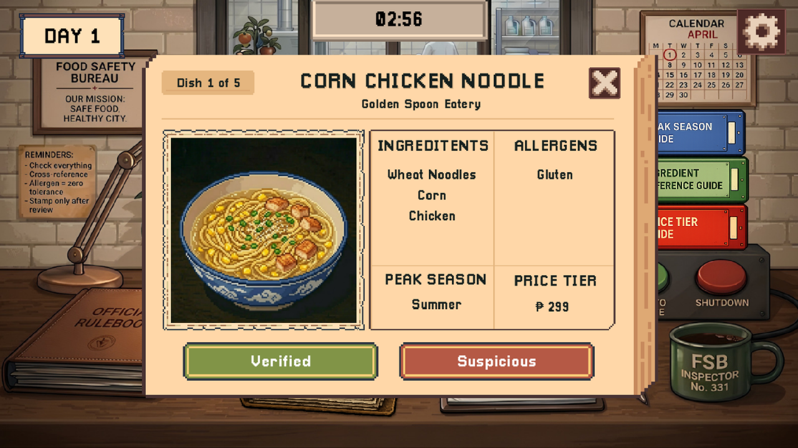
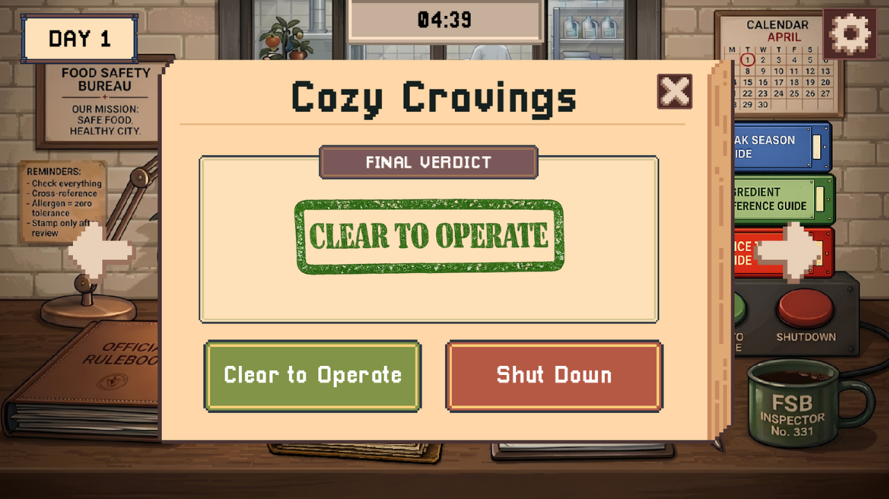
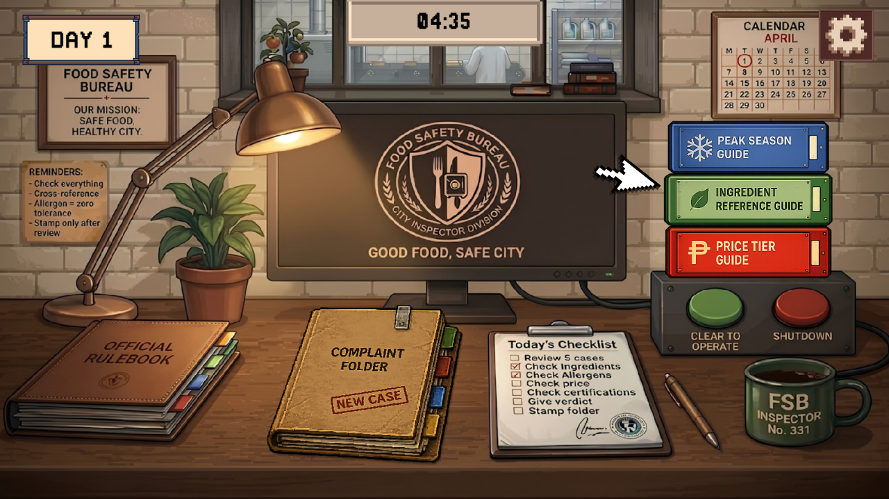
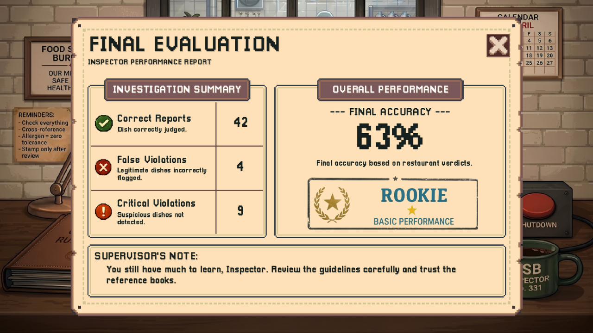

# 🎮 Something's Off the Menu

> _“Not everything on the menu is what it seems. Stay sharp, Inspector.”_

---

## 🕵️ About the Game

**Something's Off the Menu** is a food safety inspection and deduction game inspired by _Papers, Please_ and _That's Not My Neighbor_.

Players take on the role of a food safety inspector working for the **Food Safety Bureau**. Each day, players receive complaint folders containing suspicious dish reports from local restaurants.

Using three reference guides, namely, **Ingredient Reference Guide**, **Price Tier Guide**, and **Peak Season Guide**, players must carefully cross-reference each report, identify inconsistencies, and determine whether a restaurant is legitimate or fraud.

All verdicts remain hidden until **Day 6**, where the player’s overall performance is revealed and rated.

---

## 🎯 Gameplay Features

- Inspect restaurant complaint folders
- Cross-check dishes using reference guides
- Detect fraudulent or suspicious reports
- Stamp final restaurant verdicts
- Multi-day progression system
- AI-inspired validation and generation systems

---

## 📖 Quick Tutorial

### 🖥️ Workspace

  

Every day, restaurant folders appear on your desk. Use the reference guides to inspect each case before time runs out.

---

### 📂 Folders & Time Limits

  

Each workday has a global time limit.

| Day   | Folders   | Time |
| ----- | --------- | ---- |
| Day 1 | 1 Folder  | 3:00 |
| Day 2 | 2 Folders | 4:00 |
| Day 3 | 2 Folders | 4:00 |
| Day 4 | 3 Folders | 5:00 |
| Day 5 | 3 Folders | 5:00 |

> ⚠️ Unfinished folders count against your final score.

---

### 🍽️ Dish Inspection

  

Each folder contains **5 dishes**.

Check the following using your reference guides:

- Ingredients
- Allergens
- Price
- Peak Season

### Verdicts

- ✅ **Verified** — report is correct
- 🚨 **Suspicious** — report contains a violation

---

### 🧾 Restaurant Verdict Rules

  

After inspecting all 5 dishes, stamp the restaurant verdict.

### 🟢 CLEAR TO OPERATE

- 0 violations
- OR exactly 1 ingredient, price, or season violation

### 🔴 SHUT DOWN

- 1 or more allergen violations
- OR 2+ combined violations across:
    - ingredients
    - price
    - season

---

### 📚 Reference Guides

  

Three guides are always available during inspection:

| Guide                      | Purpose                            |
| -------------------------- | ---------------------------------- |
| Ingredient Reference Guide | Verifies ingredients and allergens |
| Peak Season Guide          | Verifies peak season               |
| Price Tier Guide           | Verifies price accuracy            |

---

### 🏆 Final Evaluation

  

All verdicts are revealed on **Day 6**.

| Result              | Score |
| ------------------- | ----- |
| ✅ Correct Shutdown | +100  |
| ✅ Correct Clear    | +50   |
| ❌ Missed Fraud     | −50   |
| ❌ Wrong Shutdown   | −75   |

### 👨‍🍳 Inspector Ratings

| Score     | Rating           |
| --------- | ---------------- |
| 90–100%   | Master Inspector |
| 70–89%    | Good Inspector   |
| 50–69%    | Rookie Inspector |
| Below 50% | Fired            |

---

## 🖥️ How to Run

1. Clone or download this repository
2. Open the project using **Godot 4**
3. Press **F5** to run the game

---

## 🤖 AI Algorithms Used

| Algorithm                  | Purpose                                           |
| -------------------------- | ------------------------------------------------- |
| **Backtracking Search**    | Generates legitimate or fraudulent dish reports   |
| **AC-3 (Arc Consistency)** | Validates reports against actual dish constraints |
| **Decision Tree**          | Determines each restaurant’s true verdict         |

---

## 📚 References

- Mitchell, T. M. (1997). _Machine Learning_. McGraw-Hill.  
  https://www.cs.cmu.edu/~tom/mlbook.html

- Nacho Sama. (2024). _That's Not My Neighbor_ [Video game]. Nacho Sama.  
  https://nachogames.itch.io/thats-not-my-neighbor

- Pope, L. (2013). _Papers, Please_ [Video game]. 3909 LLC.  
  https://papersplea.se/

- Russell, S., & Norvig, P. (2020). _Artificial Intelligence: A Modern Approach_ (4th ed.). Pearson.  
  https://aima.cs.berkeley.edu/

---

## 👥 Development Team

| Member                        | Role                       |
| ----------------------------- | -------------------------- |
| Bernabe, Julliane Triselle H. | Game Designer / Programmer |
| Esperon, Trisha Mae P.        | UI/UX Designer             |
| Fortus, Ralph Wendel M.       | UI/UX Designer             |
| Salazar, Clarisse Jem T.      | Documentation / Research   |
| Samson, Christelle Joy A.     | Documentation / Research   |

**Section**: BSCS 3-2

---

  <i>Truth hides behind every dish.🍽</i>

